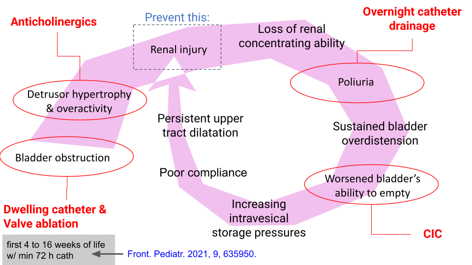
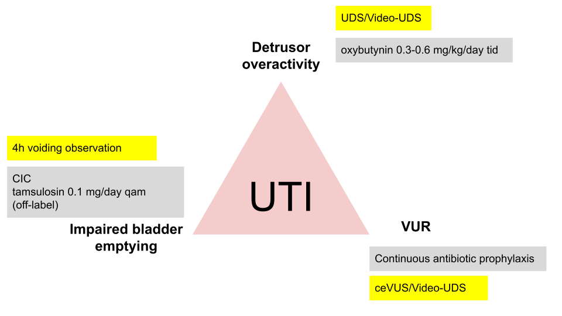
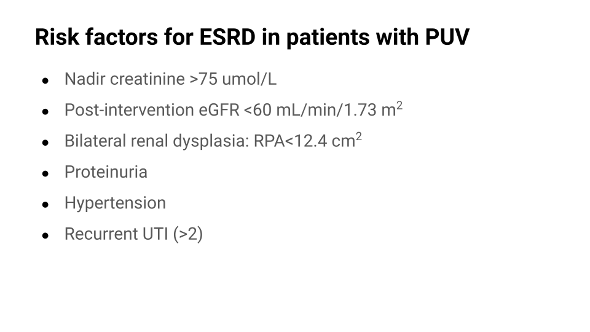

# Novorođenačka valvula stražnje uretre



### Istaknuti slide No 1

<figure><figcaption></figcaption></figure>

Prikazan je začarani krug koji uključuje primarni pormećaj pražnjenja mokraćnog mjehura i progresivno bubrežno oštećenje. Opstrukcija mokraćne cijevi rezultira hipšeraktivnim detruzorom i opstruktivnom uropatijom sa posljedičnim poremećaj koncentracijske sposobnosti bubrega i poliurijom. Distenzija mjehura dodatno otežava pražnjenje mjehura i potiče progresiju uropatije.

Zaokruženi elementi su mjesta terapijske opcije:

* Postavljanje trajnog urinarnog katetera po sumnji na valvulu i resekcija valvule stražnje uretre
* Uvođenje antikolinergika odmah nakon operativnog zahvata
* Postavljanje urinarnog katetera tijekom noći u slučaju poliurije (>2000 mL/m2). U pravilu poliuriju procjenjujem 1 mjesec nakon resekcije valvule.&#x20;
* Značajan rezidualni urin i poremećaj funkcije pražnjenja mokraćnog mjehura. Terapija je edukacija o čistoj intermitentnoj kateterizaciju. Procjenu pražnjenja mokraćnog mjehura provodimo s 4h opservacijom mokrenja.

### Istaknuti slide No 2

<figure><figcaption></figcaption></figure>

Vjerojatno najednostavniji način kako možemo pratiti liječimo li pacijenta s reseciranom valvulom kako treba je pojava infekcija mokraćnih putova.&#x20;

Tri su razloga za infekcije:

1. Vezikouretralni refluks
2. Hiperaktivnost detruzora
3. Poremećaj pražnjenja mjehura

U sivim poljima su prikazane terapijske opcije za svaki razlog infekcije, a žutim kojim dijagnostičkim postupcima ih možemo utvrditi.&#x20;

### istaknuti slide No 3

<figure><figcaption></figcaption></figure>
